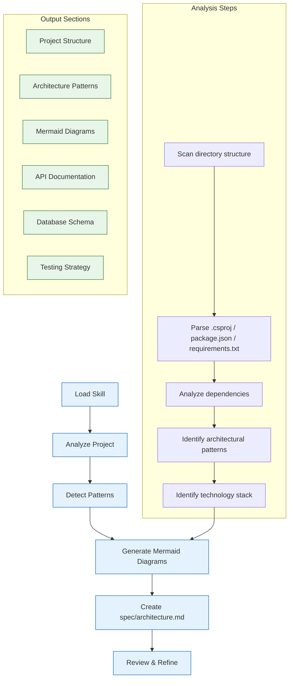
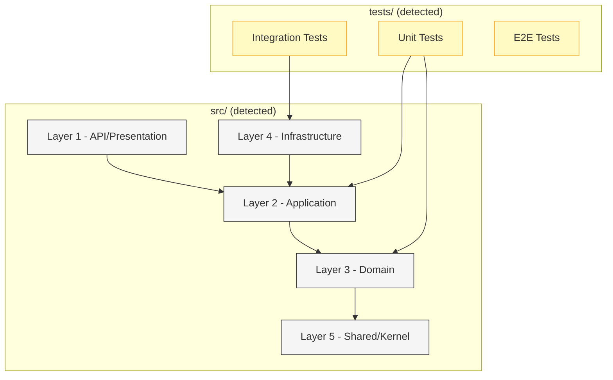
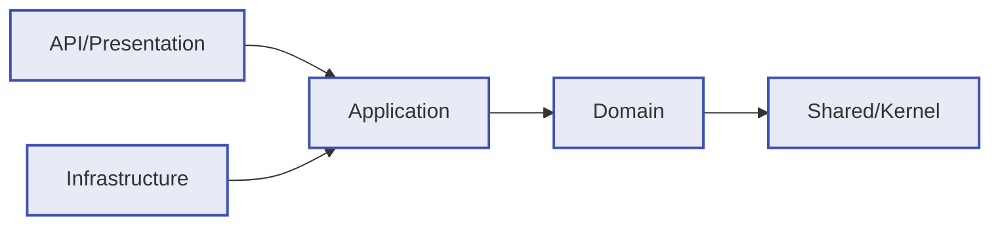
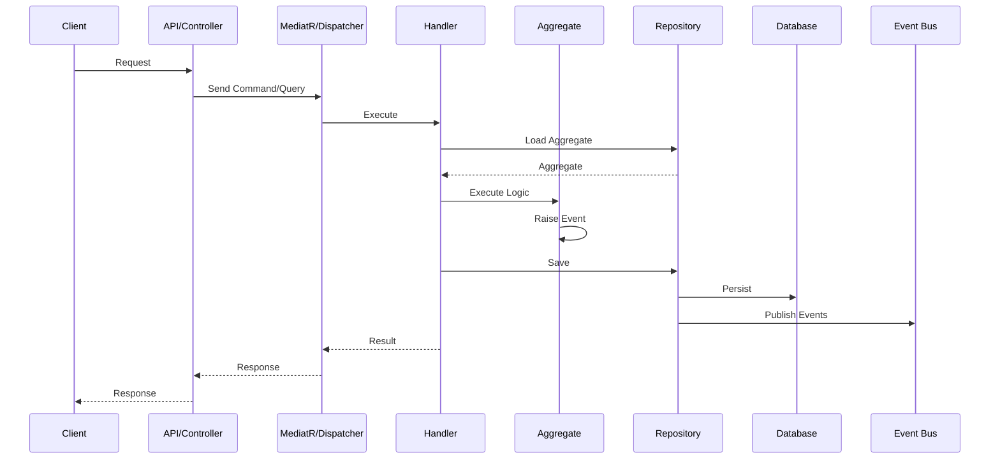
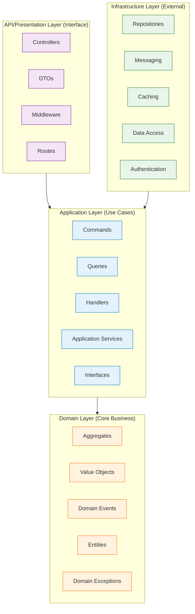
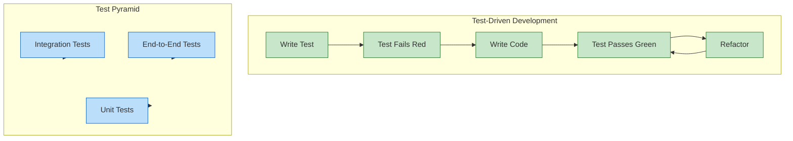
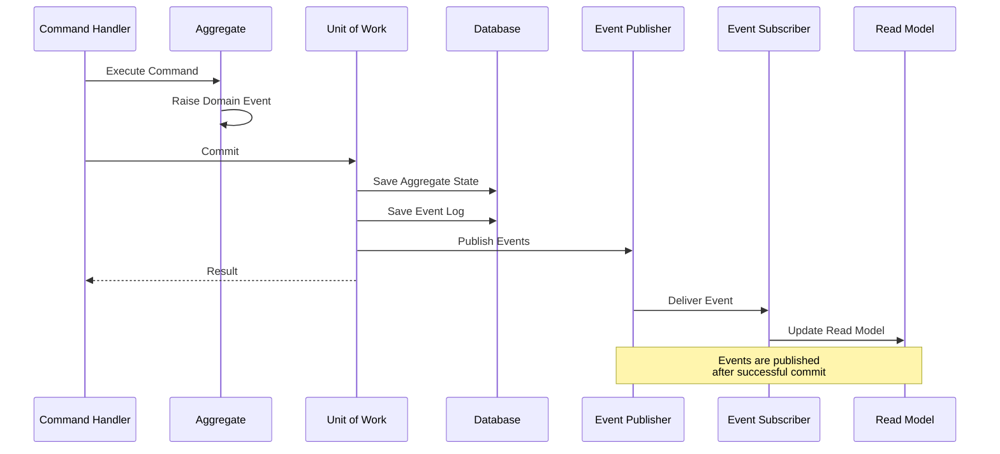
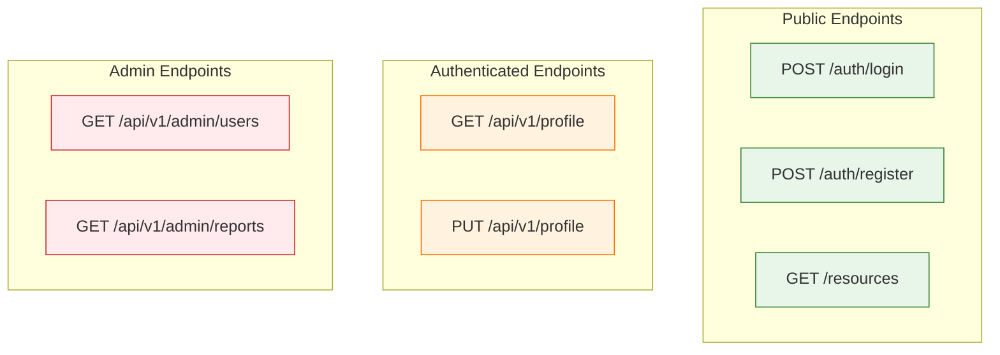
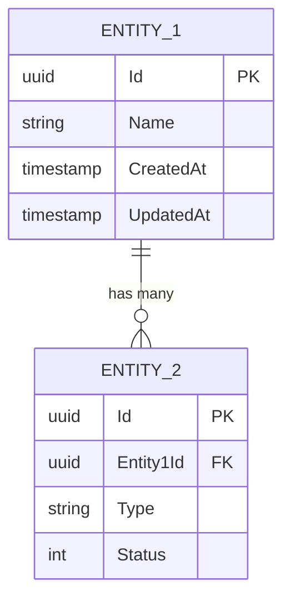

## What I Do

Analyze your project and generate comprehensive architecture documentation at `spec/architecture.md` including:

- **Project Structure Analysis**: Detect layers, modules, and their relationships
- **Pattern Detection**: Identify DDD, CQRS, Clean Architecture, TDD, SOLID patterns
- **Technology Stack**: Identify frameworks, libraries, and tools in use
- **Mermaid Diagrams**: Create project-specific flowcharts, sequence diagrams, ER diagrams
- **Dependency Analysis**: Map out dependencies and enforce clean architecture rules
- **Testing Strategy**: Document testing approaches and coverage recommendations
- **API Documentation**: Map endpoints and their relationships

---

## When to Use Me

Use me when you need to:

- Create initial architecture documentation for a new project
- Document an existing project's architecture
- Understand the structure of an unfamiliar codebase
- Generate visual diagrams for architecture reviews
- Prepare documentation for team onboarding
- Create technical specifications for stakeholders
- Document design decisions and trade-offs

---

## How I Work



---

## Analysis Process

I perform the following analysis on your project:

### 1. **Project Structure Detection**

- Scan for solution files (`.sln`, `.csproj`, `package.json`, `requirements.txt`)
- Identify layers by naming conventions:
  - `API/`, `Web/`, `Server/` → Presentation Layer
  - `Application/`, `Services/`, `Handlers/` → Application Layer
  - `Domain/`, `Core/`, `Entities/` → Domain Layer
  - `Infrastructure/`, `Data/`, `Persistence/` → Infrastructure Layer
  - `Shared/`, `Common/`, `SharedKernel/` → Shared/Kernel Layer

### 2. **Pattern Detection**

- **DDD**: Detect Aggregates (`AggregateRoot`), Value Objects (`ValueObject`), Domain Events (`DomainEvent`, `IDomainEvent`)
- **CQRS**: Detect MediatR usage, Command/Query handlers, separate read/write models
- **Clean Architecture**: Check dependency direction (outer → inner only)
- **TDD**: Check test coverage, test structure
- **SOLID**: Detect interface segregation, dependency injection patterns

### 3. **Technology Stack Identification**

- **.NET**: Framework version from `.csproj`, NuGet packages
- **TypeScript/Node**: Dependencies from `package.json`, framework (Express, NestJS, Next.js)
- **Python**: Dependencies from `requirements.txt`, `pyproject.toml`, framework (Django, FastAPI)
- **Database**: EF Core, Dapper, SQLAlchemy, TypeORM, etc.
- **Messaging**: RabbitMQ, Kafka, Azure Service Bus, etc.
- **Cache**: Redis, MemoryCache, etc.
- **Auth**: JWT, OAuth, Identity, etc.

### 4. **API Endpoint Analysis**

- Scan controllers, route handlers
- Group by resource and HTTP method
- Identify authentication/authorization requirements

### 5. **Database Schema Detection**

- Analyze Entity Framework models
- Detect migrations or SQL files
- Identify relationships and constraints

---

## Output: spec/architecture.md

The generated documentation includes:

### ✅ Auto-Generated Sections (Based on Analysis)

- Project Overview (detected name, description, type)
- Solution Structure (actual directories and their purpose)
- Architecture Patterns (detected patterns with explanations)
- Technology Stack (identified frameworks and versions)
- Dependency Rules (actual dependency graph)
- API Endpoints (detected routes grouped by resource)
- Database Schema (detected entities and relationships)
- Testing Strategy (detected test structure and tools)

### ✏️ Manual Modification Sections (Placeholders)

- Design Decisions (why specific choices were made)
- Architecture Trade-offs (alternatives considered)
- Deployment Strategy (how to deploy)
- Security Considerations (security measures)
- Performance Considerations (caching, optimization)
- Scaling Strategy (how to scale the application)
- Monitoring & Observability (logging, metrics, alerts)
- Future Enhancements (planned improvements)

---

## Mermaid Diagrams Generated

### 1. Project Structure Diagram



### 2. Dependency Rules Diagram



### 3. CQRS Flow Diagram



### 4. Clean Architecture Layers



### 5. Testing Strategy Flow



### 6. Domain Event Flow



### 7. API Endpoint Map



### 8. Database Schema (Detected)



---

## Implementation Details

### For .NET Projects

I analyze:
- `.sln` files → project structure
- `.csproj` files → dependencies, framework version
- `Controllers/` → API endpoints
- `Domain/` → aggregates, entities, value objects
- `Application/` → commands, queries, handlers
- `Infrastructure/` → repositories, services
- `MediatR` usage → CQRS pattern
- `FluentValidation` → validation strategy
- Test projects → testing structure

### For TypeScript/Node Projects

I analyze:
- `package.json` → dependencies, framework (Express, NestJS, Next.js)
- `src/` structure → layer organization
- `controllers/` or `routes/` → API endpoints
- `services/` → business logic
- `models/` or `entities/` → data models
- `repositories/` → data access
- Test files → testing approach

### For Python Projects

I analyze:
- `requirements.txt` or `pyproject.toml` → dependencies
- Framework (Django, FastAPI, Flask)
- `models.py` → database models
- `views.py` or `routers/` → API endpoints
- `services/` → business logic
- Test directory (`tests/`) → testing structure

---

## Customization Guide

After generation, you should review and update:

### 📝 Required Manual Updates

1. **Design Decisions Section** (lines marked with `<!-- TODO: -->`)
   - Explain why specific patterns were chosen
   - Document trade-offs considered
   - Reference architectural principles applied

2. **Business Rules Section**
   - Document specific business logic rules
   - Add validation rules
   - Document invariants

3. **Deployment Strategy**
   - How to deploy (Docker, Kubernetes, Cloud)
   - Environment configurations
   - CI/CD pipeline

4. **Security Considerations**
   - Authentication/Authorization approach
   - Data encryption
   - Secrets management
   - Security headers and policies

5. **Performance Considerations**
   - Caching strategy
   - Database indexing
   - Query optimization
   - Async processing

6. **Monitoring & Observability**
   - Logging framework and levels
   - Metrics collection
   - Alerting rules
   - Distributed tracing

7. **Future Enhancements**
   - Planned features
   - Technical debt to address
   - Refactoring opportunities

---

## Usage Example

```
User: "Generate architecture documentation for this project"

Skill (me):
1. Scans project structure
2. Detects patterns:
   - Clean Architecture with 5 layers
   - CQRS with MediatR
   - DDD with Aggregates and Domain Events
   - TDD with unit and integration tests
3. Identifies tech stack:
   - .NET 8
   - EF Core 8 with SQL Server
   - RabbitMQ for messaging
   - SignalR for real-time
   - xUnit for testing
4. Generates spec/architecture.md with:
   - Project overview
   - Mermaid diagrams (structure, dependencies, CQRS flow)
   - Detected API endpoints
   - Database schema
   - Testing strategy
   - Placeholder sections for customization
```

---

## Requirements

- Project must have recognizable structure (layers, tests)
- Supported languages: .NET (primary), TypeScript/Node, Python
- Must be in a git repository for best results

---

## Output Format

The generated `spec/architecture.md` will have:

```markdown
# Architecture Documentation

## Auto-Generated Content
- Project Overview
- Solution Structure
- Architecture Patterns
- Technology Stack
- Dependency Analysis
- API Endpoints
- Database Schema
- Testing Strategy

## Mermaid Diagrams
- Project Structure
- Dependency Rules
- CQRS Flow
- Clean Architecture Layers
- Testing Strategy
- Domain Event Flow
- API Endpoint Map
- Database Schema

## Manual Sections (TODO)
- Design Decisions
- Architecture Trade-offs
- Deployment Strategy
- Security Considerations
- Performance Considerations
- Scaling Strategy
- Monitoring & Observability
- Future Enhancements
```

---

## Notes

- This skill generates **project-specific** documentation based on actual code analysis
- Mermaid diagrams will reflect your actual project structure
- Placeholders are provided for sections that require human judgment
- All diagrams use standard Mermaid syntax compatible with GitHub, GitLab, VS Code
- The documentation should be kept in sync with code changes (consider adding to CI/CD)
