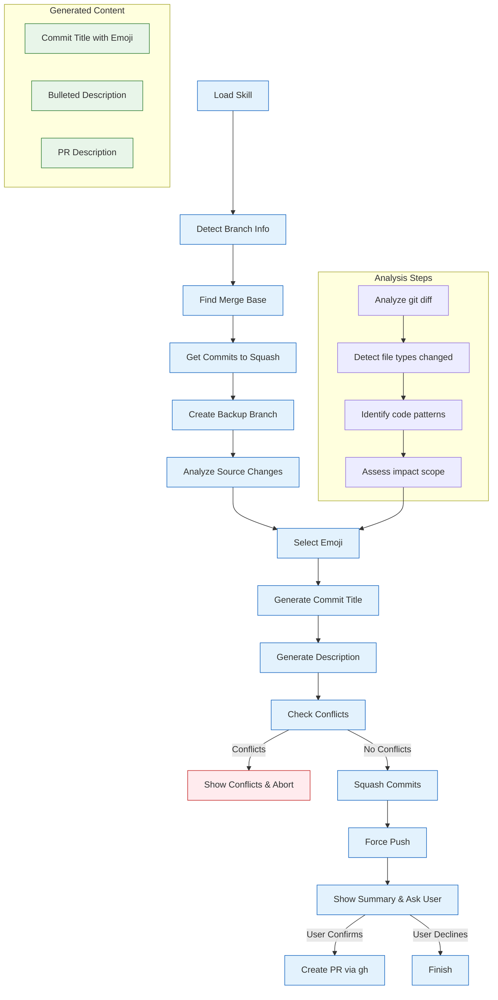

## What I Do

Analyze your current branch and squash all commits into a single well-formatted commit, then create a pull request with:

- **Automatic Commit Analysis**: Analyze all commits since last merged point
- **Smart Emoji Selection**: Choose appropriate git emoji based on changes detected
- **Source Code Analysis**: Examine actual diff to generate accurate descriptions
- **Backup Creation**: Always create backup branch before squashing
- **Conflict Safety**: Abort and show conflicts if merge issues occur
- **PR Creation**: Ask user confirmation before creating PR with gh tool
- **Bulleted Description**: Generate clean, bulleted summary of changes

---

## When to Use Me

Use me when you need to:

- Clean up a feature branch with multiple WIP commits
- Prepare a feature branch for code review
- Create a professional, single-commit pull request
- Enforce commit hygiene standards
- Document changes comprehensively before PR
- Consolidate experimental commits into a cohesive feature

---

## How I Work



---

## Workflow Steps

### 1. **Detect Branch Information**

- Identify current branch using `git rev-parse --abbrev-ref HEAD`
- Detect parent branch (main/master via `git symbolic-ref refs/remotes/origin/HEAD` or tracking branch)
- Verify we're not on main/master (abort if on protected branch)

### 2. **Find Merge Base**

- Find common ancestor with parent branch: `git merge-base HEAD main`
- This identifies the last merged commit
- All commits between merge base and HEAD will be squashed

### 3. **Get Commits to Squash**

- List all commits: `git log --oneline MERGE_BASE..HEAD`
- Count commits
- Display commit messages to user

### 4. **Create Backup Branch**

- Always create backup before any destructive operation
- Format: `<current-branch>-backup-<date>-<time>`
- Example: `feature/user-auth-backup-2024-03-24-14-30`
- Use `git branch <backup-name>`

### 5. **Analyze Source Changes**

- Get full diff: `git diff --stat MERGE_BASE..HEAD`
- Analyze file types:
  - `.cs`, `.csproj` → C# changes
  - `.ts`, `.tsx`, `.js`, `.jsx` → TypeScript/JavaScript changes
  - `.py` → Python changes
  - `.sql`, `.cs` with migrations → Database changes
  - `.md` → Documentation changes
  - Test files → Test changes

- Detect patterns:
  - New files added vs modified
  - Files deleted
  - Lines added/removed per file type

### 6. **Select Appropriate Emoji**

Based on analysis, choose emoji:

| Type | Emoji | Description |
|---|---|---|
| New Feature | ✨ `feat` | New functionality |
| Bug Fix | 🐛 `fix` | Bug fix |
| Breaking Change | 💥 `breaking` | Breaking API change |
| Refactoring | ♻️ `refactor` | Code refactoring |
| Documentation | 📝 `docs` | Documentation only |
| Performance | ⚡ `perf` | Performance improvement |
| Tests | ✅ `test` | Adding/updating tests |
| Security | 🔒 `security` | Security fixes |
| Build | 🚀 `build` | Build system/CI/CD |
| CI/CD | 🤖 `ci` | CI/CD changes |
| Dependencies | 📦 `deps` | Dependency updates |
| Style | 💄 `style` | Code style changes (formatting) |
| Remove | 🗑️ `remove` | Removing code/files |
| Upgrade | ⬆️ `upgrade` | Upgrade dependencies |
| Downgrade | ⬇️ `downgrade` | Downgrade dependencies |
| Configuration | ⚙️ `config` | Configuration changes |
| Translation | 🌐 `i18n` | Internationalization |
| Accessibility | ♿ `a11y` | Accessibility improvements |
| Work In Progress | 🚧 `wip` | Work in progress |

### 7. **Generate Commit Title**

Format: `[emoji] <type>: <concise description>`

Examples:
- `✨ feat: add user authentication with JWT tokens`
- `🐛 fix: resolve memory leak in event handler`
- `📝 docs: update API documentation for v2`
- `♻️ refactor: simplify domain layer structure`
- `⚡ perf: optimize database queries with caching`
- `🔒 security: implement refresh token rotation`
- `✅ test: add unit tests for booking aggregate`

Rules:
- Keep under 72 characters
- Use imperative mood ("add" not "added")
- Be specific but concise
- Include emoji first, then conventional commit type

### 8. **Generate Commit Description**

Bulleted points organized by category:

```markdown
✨ feat: add user authentication with JWT tokens

## Changes
- Added JWT-based authentication system with short-lived access tokens
- Implemented refresh token rotation with reuse detection
- Created authentication endpoints: /auth/register, /auth/login, /auth/refresh
- Added token revocation endpoint for security

## Database
- Added Users table with Id, Email, PasswordHash, RefreshToken
- Added IdempotencyKeys table for request deduplication

## Files Modified
- EMS.Domain/Entities/User.cs (new)
- EMS.Application/Commands/RegisterUserHandler.cs (new)
- EMS.API/Controllers/AuthController.cs (new)
- EMS.Infrastructure/Services/JwtTokenService.cs (new)

## API Endpoints
- POST /api/v1/auth/register
- POST /api/v1/auth/login
- POST /api/v1/auth/refresh
- POST /api/v1/auth/revoke

## Testing
- Added unit tests for authentication commands
- Added integration tests for token refresh flow
- Added tests for refresh token reuse detection

## Breaking Changes
- None

## Notes
- Access tokens expire after 15 minutes
- Refresh tokens expire after 7 days
- All authentication endpoints are rate-limited
```

Categories to include:
- **Changes**: High-level summary
- **Database**: Schema changes
- **Files Modified**: List of key files
- **API Endpoints**: New/modified endpoints (if applicable)
- **Testing**: Test coverage added
- **Breaking Changes**: Any breaking changes
- **Notes**: Important implementation details

### 9. **Check for Conflicts**

- Attempt soft reset to merge base: `git reset --soft MERGE_BASE`
- Run `git status` to check for conflicts
- If conflicts exist:
  - Display conflict files and details
  - Abort squash: `git reset --hard HEAD@{1}`
  - Show user how to resolve conflicts manually
  - Exit with error message
- If no conflicts, continue to squash

### 10. **Perform Squash**

- Create commit with generated message: `git commit -m "<message>"`
- Force push to remote: `git push --force-with-lease origin <branch>`

### 11. **Show Summary and Ask User**

Display:
```
=== Squash Summary ===
✅ Squashed 7 commits into 1 commit
📦 Backup branch: feature-user-auth-backup-2024-03-24-14-30

=== Generated Commit ===
✨ feat: add user authentication with JWT tokens

## Changes
- Added JWT-based authentication system...
[rest of description]

=== Pull Request ===
Branch: feature/user-auth → main
Commits: 1 (squashed from 7)
Files changed: 15

Create pull request to main? (y/n)
```

### 12. **Create PR (if user confirms)**

- Use `gh pr create` with:
  - Title: commit title (without emoji for PR title, or keep emoji)
  - Body: commit description
  - Base: main (or detected parent branch)
  - Head: current branch
- Command:
  ```bash
  gh pr create \
    --title "feat: add user authentication with JWT tokens" \
    --body "<commit description>" \
    --base main \
    --head feature/user-auth
  ```
- Return PR URL to user

---

## Git Emoji Reference

### Feature Emojis
- ✨ `feat` - New feature
- 🚀 `launch` - Launch feature
- 💡 `idea` - New idea or concept

### Fix Emojis
- 🐛 `fix` - Bug fix
- 🚑 `hotfix` - Critical hotfix
- 🔥 `fire` - Critical issue fix

### Refactor Emojis
- ♻️ `refactor` - Refactoring code
- 🏗️ `architecture` - Architectural changes
- 🧹 `cleanup` - Code cleanup

### Documentation Emojis
- 📝 `docs` - Documentation
- ✏️ `edit` - Editing documentation
- 📚 `wiki` - Wiki changes

### Performance Emojis
- ⚡ `perf` - Performance improvement
- 🚀 `speed` - Speed optimization
- 💾 `optimize` - Optimization

### Testing Emojis
- ✅ `test` - Adding tests
- 🧪 `tests` - Test coverage
- 📊 `coverage` - Coverage reports

### Security Emojis
- 🔒 `security` - Security fixes
- 🔐 `lock` - Security features
- 🛡️ `shield` - Security improvements

### Build/CI Emojis
- 🚀 `build` - Build system
- 🤖 `ci` - CI/CD changes
- 📦 `deps` - Dependency updates

### Code Style Emojis
- 💄 `style` - Code style changes
- 🎨 `design` - Design changes
- ✨ `sparkle` - Polish/refinement

### Database Emojis
- 🗄️ `db` - Database changes
- 📊 `schema` - Schema changes
- 🔍 `migration` - Database migration

### Configuration Emojis
- ⚙️ `config` - Configuration
- 🔧 `settings` - Settings changes
- 🌐 `env` - Environment config

### Other Emojis
- 🗑️ `remove` - Removing code
- ⬆️ `upgrade` - Upgrade
- ⬇️ `downgrade` - Downgrade
- 🌐 `i18n` - Internationalization
- ♿ `a11y` - Accessibility
- 🚧 `wip` - Work in progress
- 🎉 `release` - Release
- 💥 `breaking` - Breaking change

---

## Conflict Handling

If conflicts are detected:

```bash
=== Conflicts Detected ===
The following files have merge conflicts:
- EMS.Application/Services/BookingService.cs
- EMS.Infrastructure/Data/AppDbContext.cs

=== Squash Aborted ===
Your changes have been restored to original state.
Backup branch: feature-user-auth-backup-2024-03-24-14-30

=== Next Steps ===
1. Resolve conflicts manually:
   git status
   # Edit conflicting files
   git add .
   git commit

2. Re-run this skill after resolving conflicts

3. Or restore from backup if needed:
   git checkout feature-user-auth-backup-2024-03-24-14-30
```

---

## Commands Used

```bash
# Branch detection
git rev-parse --abbrev-ref HEAD
git symbolic-ref refs/remotes/origin/HEAD --short

# Merge base detection
git merge-base HEAD main

# Commit analysis
git log --oneline MERGE_BASE..HEAD
git diff --stat MERGE_BASE..HEAD
git diff --name-status MERGE_BASE..HEAD

# Backup creation
git branch <backup-name>

# Squash operation
git reset --soft MERGE_BASE
git status
git commit -m "<message>"

# Force push
git push --force-with-lease origin <branch>

# PR creation
gh pr create --title "<title>" --body "<body>" --base main --head <branch>

# Conflict recovery
git reset --hard HEAD@{1}
```

---

## Safety Features

1. **Always create backup**: Never modify branch without backup
2. **Conflict detection**: Abort before destructive changes
3. **Force-with-lease**: Safer force push that checks remote state
4. **User confirmation**: Ask before creating PR
5. **Clear rollback instructions**: Always provide path to restore

---

## Requirements

- Git installed and configured
- GitHub CLI (`gh`) installed and authenticated
- Current branch must not be main/master
- Must have push permissions to remote repository
- Branch must have at least one commit to squash

---

## Usage Example

```
User: "Squash my commits and create PR"

Skill (me):
1. Detecting branch information...
   Current: feature/user-auth
   Parent: main

2. Finding merge base...
   Merge base: a1b2c3d4 (Initial commit)

3. Analyzing commits...
   7 commits to squash:
   - Add User entity
   - Create auth endpoints
   - Implement JWT service
   - Add refresh token logic
   - Create auth commands
   - Add auth tests
   - Update documentation

4. Creating backup...
   ✅ Backup branch: feature-user-auth-backup-2024-03-24-14-30

5. Analyzing changes...
   Files: 15 changed (12 new, 3 modified)
   Lines: +450 -50
   Categories: Authentication, Database, Tests

6. Generating commit message...
   Title: ✨ feat: add user authentication with JWT tokens
   Description: [bulleted summary]

7. Squashing commits...
   ✅ Reset to merge base (soft)
   ✅ Created single commit
   ✅ Force pushed to remote

8. Summary:
   ✅ Squashed 7 commits → 1 commit
   📦 Backup: feature-user-auth-backup-2024-03-24-14-30
   📝 Commit: ✨ feat: add user authentication with JWT tokens

   Create PR to main? (y/n) > y

9. Creating PR...
   ✅ PR created: https://github.com/user/repo/pull/42

```

---

## Notes

- This skill only creates PRs to main/master by default
- For other target branches, specify when invoking skill
- Backup branch naming includes timestamp for easy identification
- Commit message follows Conventional Commits format with emojis
- Always review generated message before squash
- Conflicts must be resolved manually - skill cannot auto-merge
- Skill preserves original commit history in backup branch
