# Architecture Documentation

**Project**: EMS (Event Management System)
**Type**: Modular Monolith REST API
**Generated**: March 24, 2026
**Version**: 1.0.0

---

## Table of Contents

1. [Project Overview](#project-overview)
2. [Solution Structure](#solution-structure)
3. [Architecture Patterns](#architecture-patterns)
4. [Technology Stack](#technology-stack)
5. [Dependency Rules](#dependency-rules)
6. [Clean Architecture Layers](#clean-architecture-layers)
7. [CQRS Implementation](#cqrs-implementation)
8. [Domain-Driven Design (DDD)](#domain-driven-design-ddd)
9. [API Endpoints](#api-endpoints)
10. [Database Schema](#database-schema)
11. [Testing Strategy](#testing-strategy)
12. [Domain Event Flow](#domain-event-flow)
13. [Security & Authentication](#security--authentication)
14. [Performance Considerations](#performance-considerations)
15. [Design Decisions](#design-dedecisions) <!-- TODO: Manual Update -->
16. [Deployment Strategy](#deployment-strategy) <!-- TODO: Manual Update -->
17. [Future Enhancements](#future-enhancements) <!-- TODO: Manual Update -->

---

## Project Overview

EMS (Event Management System) is a modular monolith REST API built with .NET 10.0, implementing Clean Architecture, Domain-Driven Design (DDD), CQRS, and following Test-Driven Development (TDD) principles.

**Key Characteristics**:
- **Architecture Style**: Modular Monolith with Clean Architecture
- **API Type**: REST API with URL-based versioning (`/api/v1/`)
- **Paradigm**: Event-driven with domain events and messaging
- **Testing**: TDD approach with unit and integration tests

**Project Status**: Development phase - Core architecture implemented, business domain in progress

---

## Solution Structure

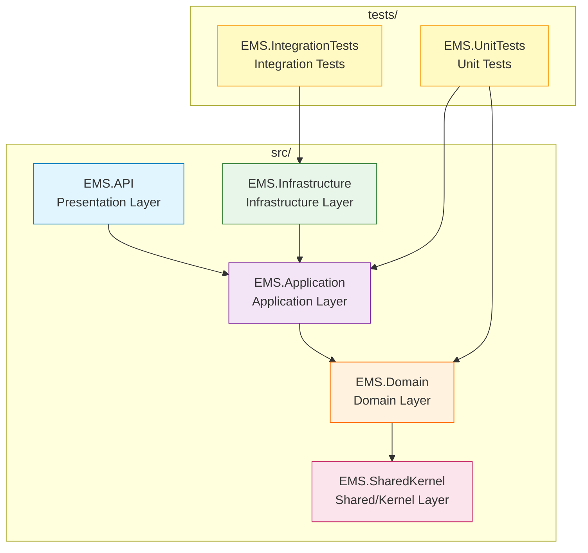

### Layer Responsibilities

| Layer | Responsibility | Dependencies |
|---|---|---|
| **EMS.SharedKernel** | Primitives: AggregateRoot, Entity, ValueObject, IDomainEvent, Result<T>, Error, PagedResult | None |
| **EMS.Domain** | Aggregates, Entities, Value Objects, Domain Events, Business Rules, Exceptions | EMS.SharedKernel only |
| **EMS.Application** | Commands, Queries, Handlers, Interfaces, Pipeline Behaviors, Application Services | EMS.Domain, EMS.SharedKernel |
| **EMS.Infrastructure** | Dapper repositories, EF migrations, RabbitMQ, SignalR, Cache, Auth, File Storage | EMS.Application, EMS.Domain, EMS.SharedKernel |
| **EMS.API** | Controllers, Hubs, Middleware, Program.cs, Request/Response DTOs | EMS.Application, EMS.Domain, EMS.SharedKernel |
| **EMS.UnitTests** | Domain rule tests, Application handler tests, Builders, Fakes | EMS.Domain, EMS.Application |
| **EMS.IntegrationTests** | Persistence tests, Messaging tests, E2E scenarios, Testcontainers | EMS.Infrastructure, All layers |

---

## Architecture Patterns

### Implemented Patterns

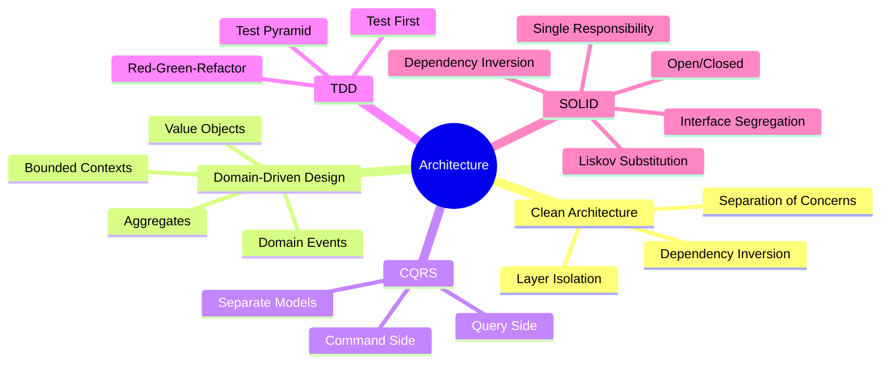

### Pattern Detection Summary

| Pattern | Status | Evidence |
|---|---|---|
| **Clean Architecture** | ✅ Implemented | 5 layers with dependency inversion |
| **DDD** | ✅ Implemented | AggregateRoot, ValueObject, IDomainEvent in SharedKernel |
| **CQRS** | ✅ Implemented | MediatR with Commands/Queries/Handlers |
| **TDD** | ✅ Implemented | EMS.UnitTests and EMS.IntegrationTests projects |
| **SOLID** | ✅ Implemented | Interfaces in Application, Dependency Injection |

---

## Technology Stack

### Core Framework

| Component | Technology | Version | Purpose |
|---|---|---|---|
| **Runtime** | .NET | 10.0 | Core framework |
| **Language** | C# | 12 | Primary language |
| **API** | ASP.NET Core | 10.0 | REST API framework |

### Architecture & Patterns

| Component | Technology | Version | Purpose |
|---|---|---|---|
| **CQRS** | MediatR | 12.4.1 | Command/Query separation |
| **Validation** | FluentValidation | 12.0.0 | Input validation with pipeline behavior |
| **Result Pattern** | Custom | - | Result<T> for operation outcomes |

### Data Access & Database

| Component | Technology | Version | Purpose |
|---|---|---|---|
| **ORM** | Entity Framework Core | 10.0.0 | Migrations and Identity |
| **Micro-ORM** | Dapper | 2.1.35 | High-performance queries |
| **Database** | SQL Server | - | Primary database (LocalDB dev / Full prod) |
| **Concurrency** | RowVersion | - | Optimistic concurrency control |

### Messaging & Events

| Component | Technology | Version | Purpose |
|---|---|---|---|
| **Message Broker** | RabbitMQ.Client | 7.0.0 | Domain event publishing/consumption |
| **Exchange Type** | Fanout | - | Broadcast events to all consumers |
| **Real-time** | SignalR | 1.2.0 | Live notifications (progress, bookings) |

### Security & Authentication

| Component | Technology | Version | Purpose |
|---|---|---|---|
| **Authentication** | JWT Bearer | 10.0.0 | Short-lived access tokens |
| **Refresh Tokens** | Custom | - | Strict rotation with reuse detection |
| **Password Hashing** | BCrypt.Net-Next | 4.0.3 | Secure password storage |
| **Rate Limiting** | AspNetCoreRateLimit | 5.0.0 | Booking endpoint protection |

### Caching & Performance

| Component | Technology | Version | Purpose |
|---|---|---|---|
| **Hybrid Cache** | Microsoft.Extensions.Caching.Hybrid | 10.0.0 | Memory + Distributed caching |
| **Cache Strategy** | Read-through | - | Application layer caching |

### Logging & Monitoring

| Component | Technology | Version | Purpose |
|---|---|---|---|
| **Logging** | Serilog.AspNetCore | 8.0.3 | Structured logging |
| **Sinks** | Console, File | 6.0.0 | Log destinations |
| **Correlation ID** | Custom | - | Request tracking across layers |

### File Processing & Storage

| Component | Technology | Version | Purpose |
|---|---|---|---|
| **CSV Processing** | CsvHelper | 33.0.1 | Report generation |
| **File Storage** | IFileStorageService (abstraction) | - | Pluggable storage provider |
| **Default Storage** | LocalFileStorageService | - | Local file system storage |

### Testing

| Component | Technology | Version | Purpose |
|---|---|---|---|
| **Unit Tests** | TUnit | - | Domain and Application tests |
| **Integration Tests** | Testcontainers | - | DB + RabbitMQ + E2E scenarios |
| **Test Framework** | xUnit (likely) | - | Test execution (to be confirmed) |

---

## Dependency Rules

### Dependency Direction

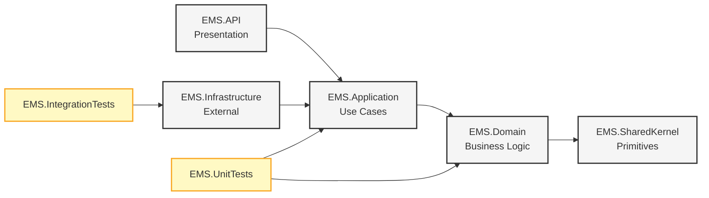

### Critical Rules (Non-Negotiable)

1. **EMS.Domain has ZERO infrastructure dependencies**
   - No EF Core, no Dapper, no RabbitMQ, no SignalR
   - Only depends on EMS.SharedKernel

2. **EMS.Application defines all interfaces**
   - Infrastructure implements application interfaces
   - No infrastructure types in Application layer

3. **No query handler reads from command-side tables directly**
   - Use read models for queries
   - Separate read/write concerns

4. **Dependencies always point inward toward the Domain**
   - Outer layers depend on inner layers
   - Inner layers are independent

5. **SharedKernel contains ONLY primitives**
   - AggregateRoot, Entity, ValueObject, IDomainEvent
   - Result<T>, Error, PagedResult
   - No business logic, no infrastructure code

---

## Clean Architecture Layers

### Layer Overview

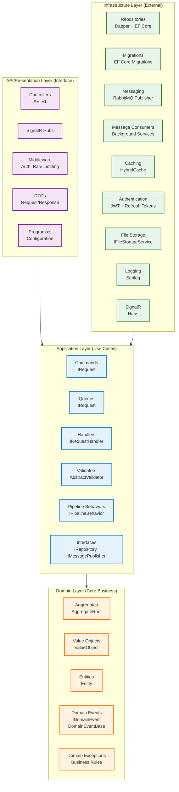

### Layer Details

#### Domain Layer (EMS.Domain)
**Responsibility**: Core business logic, invariants, domain model

**Contains**:
- Aggregates: Root entities with business rules
- Entities: Domain objects with identity
- Value Objects: Immutable objects compared by value
- Domain Events: Business events raised by aggregates
- Domain Exceptions: Business rule violations
- Specifications: Business rule predicates (if needed)

**Dependencies**: EMS.SharedKernel ONLY

#### Application Layer (EMS.Application)
**Responsibility**: Use cases, orchestration, interfaces

**Contains**:
- Commands: Write operations (IRequest<Result<T>>)
- Queries: Read operations (IRequest<Result<T>>)
- Handlers: Command/Query execution logic
- Validators: FluentValidation rules
- Pipeline Behaviors: Cross-cutting concerns (logging, validation, audit)
- Interfaces: Repository, MessagePublisher, FileStorage, etc.

**Dependencies**: EMS.Domain, EMS.SharedKernel

#### Infrastructure Layer (EMS.Infrastructure)
**Responsibility**: External concerns, implementations

**Contains**:
- Repositories: Dapper queries + EF Core for migrations
- Messaging: RabbitMQ publisher/consumer
- Caching: Hybrid cache implementation
- Authentication: JWT token generation, refresh token management
- File Storage: LocalFileStorageService (default)
- Logging: Serilog configuration
- SignalR: Hubs for real-time notifications

**Dependencies**: EMS.Application, EMS.Domain, EMS.SharedKernel

#### API Layer (EMS.API)
**Responsibility**: Interface to external world

**Contains**:
- Controllers: REST API endpoints (v1)
- SignalR Hubs: Real-time notifications
- Middleware: Authentication, rate limiting, error handling
- DTOs: Request/response models
- Program.cs: Application configuration and startup

**Dependencies**: EMS.Application, EMS.Domain, EMS.SharedKernel

---

## CQRS Implementation

### CQRS Flow

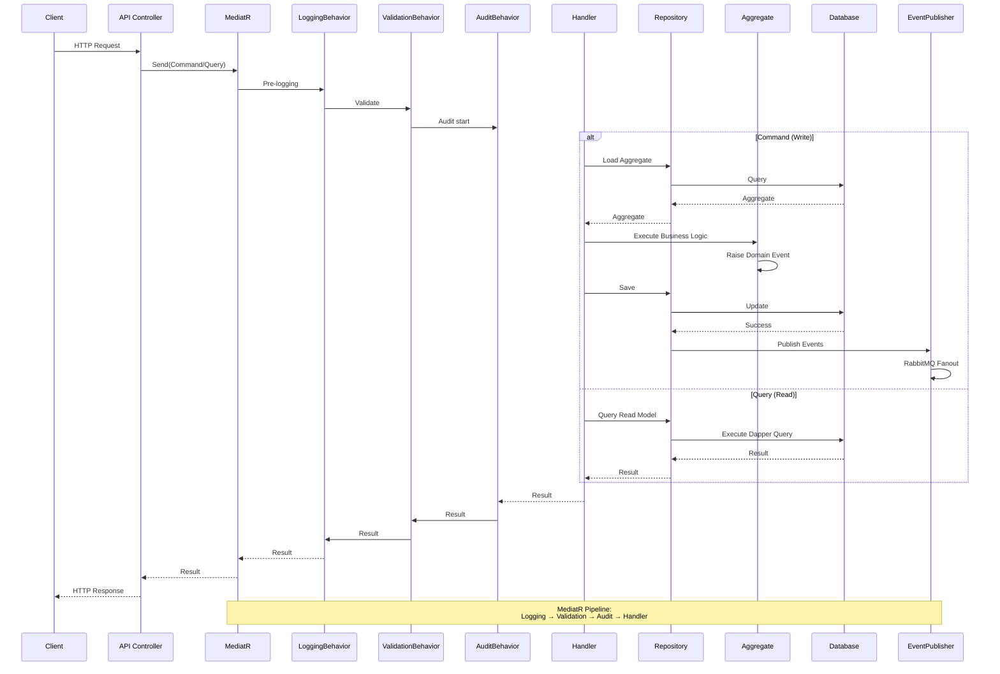

### MediatR Pipeline Order

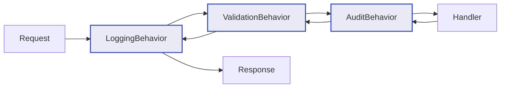

**Pipeline Responsibilities**:

| Behavior | Purpose | Throws On Failure? | Output |
|---|---|---|---|
| **LoggingBehavior** | Log request + response with CorrelationId | No | Continues |
| **ValidationBehavior** | FluentValidation, invalid input → 400 Bad Request | Yes | Returns validation errors |
| **AuditBehavior** | Write to AuditLogs table for write commands only | No | Continues |

### Command vs Query Separation

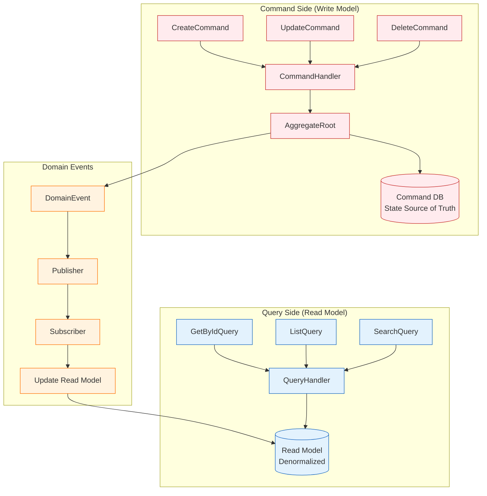

**Key Principles**:
- **Command handlers modify state** through aggregates
- **Query handlers read from read models** (never from command tables)
- **Domain events synchronize read models** asynchronously
- **No Outbox Pattern** - events published after DB commit
- **State DB is source of truth** (no event sourcing)

---

## Domain-Driven Design (DDD)

### DDD Elements in EMS

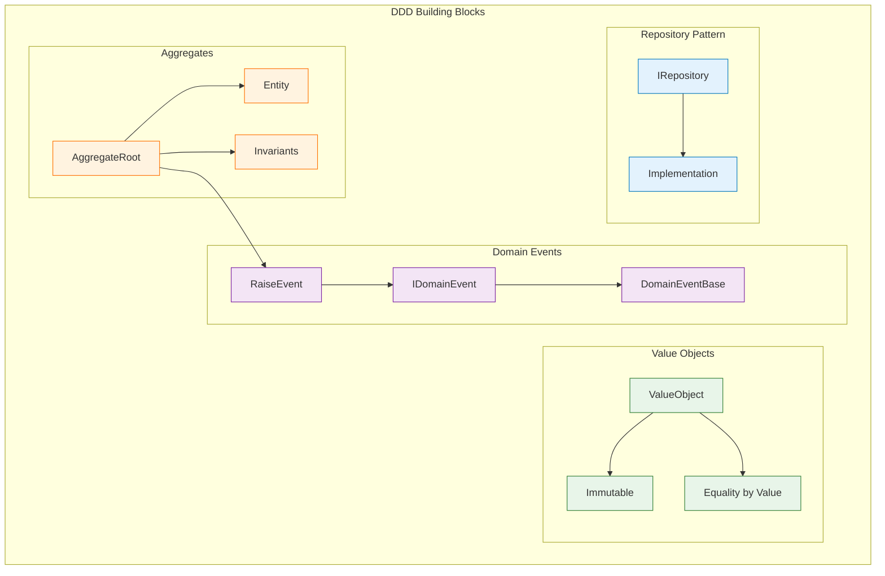

### Aggregates

**AggregateRoot<TId>** (in EMS.SharedKernel):
```csharp
public abstract class AggregateRoot<TId> : Entity<TId> where TId : notnull
{
    private readonly List<IDomainEvent> _domainEvents = new();
    public IReadOnlyList<IDomainEvent> DomainEvents => _domainEvents.AsReadOnly();

    protected void RaiseDomainEvent(IDomainEvent domainEvent)
    {
        _domainEvents.Add(domainEvent);
    }

    public IReadOnlyList<IDomainEvent> PullDomainEvents()
    {
        var events = _domainEvents.ToList();
        _domainEvents.Clear();
        return events;
    }
}
```

**Usage**:
- Each aggregate is a consistency boundary
- Business rules enforced within aggregate
- Domain events raised for side effects
- Repository loads/saves whole aggregates

### Value Objects

**ValueObject** (in EMS.SharedKernel):
- Immutable
- Equality by value, not reference
- No identity
- Often replaced, never modified

**Examples** (to be implemented):
- `EmailAddress`
- `Money` / `Currency`
- `Address`
- `DateRange` / `TimeRange`

### Domain Events

**IDomainEvent** (in EMS.SharedKernel):
```csharp
public interface IDomainEvent { }

public abstract class DomainEventBase : IDomainEvent
{
    public Guid EventId { get; }
    public DateTime OccurredAt { get; }
    public string CorrelationId { get; }
}
```

**Flow**:
1. Aggregate raises domain event
2. Handler pulls events after successful commit
3. Publisher sends to RabbitMQ
4. Consumers update read models
5. SignalR sends notifications (if applicable)

### Bounded Contexts

**EMS Bounded Contexts** (identified):
- **Authentication Context**: Users, roles, tokens
- **Event Management Context**: Events, bookings, waitlist
- **Reporting Context**: Report jobs, attendance, analytics
- **Notification Context**: SignalR, real-time updates

---

## API Endpoints

### Endpoint Structure

```mermaid
graph TB
    subgraph Public["Public Endpoints"]
        AUTH[POST /api/v1/auth/register]
        LOGIN[POST /api/v1/auth/login]
    end

    subgraph Authenticated["Authenticated Endpoints"]
        REF[POST /api/v1/auth/refresh]
        REV[POST /api/v1/auth/revoke]
        EVE[GET /api/v1/events]
        EVI[GET /api/v1/events/{id}]
        BOK[GET /api/v1/bookings]
    end

    subgraph Organizer["Organizer Endpoints"]
        CREE[POST /api/v1/events]
        UPE[PUT /api/v1/events/{id}]
        DELE[DELETE /api/v1/events/{id}]
        EBO[GET /api/v1/events/{id}/bookings]
    end

    subgraph RateLimited["Rate Limited Endpoints"]
        BOO[POST /api/v1/events/{id}/bookings]
        CAN[DELETE /api/v1/bookings/{id}]
    end

    subgraph Admin["Admin Endpoints"]
        USR[GET /api/v1/users]
        ROL[PATCH /api/v1/users/{id}/role]
        REE[GET /api/v1/reports/events]
        REA[GET /api/v1/reports/attendance]
        REX[POST /api/v1/reports/export]
        RES[GET /api/v1/reports/status/{jobId}]
    end

    classDef pub fill:#e8f5e9,stroke:#2e7d32
    classDef auth fill:#fff3e0,stroke:#ff6f00
    classDef org fill:#e3f2fd,stroke:#0277bd
    classDef rate fill:#ffebee,stroke:#c62828
    classDef adm fill:#f3e5f5,stroke:#7b1fa2

    class AUTH,LOGIN pub
    class REF,REV,EVE,EVI,BOK auth
    class CREE,UPE,DELE,EBO org
    class BOO,CAN rate
    class USR,ROL,REE,REA,REX,RES adm
```

### Endpoint Summary

| Method | Path | Description | Auth | Rate Limited |
|---|---|---|---|---|
| `POST` | `/api/v1/auth/register` | Register new user | ❌ No | ❌ No |
| `POST` | `/api/v1/auth/login` | Login user | ❌ No | ❌ No |
| `POST` | `/api/v1/auth/refresh` | Refresh access token | ✅ Yes | ❌ No |
| `POST` | `/api/v1/auth/revoke` | Revoke refresh token | ✅ Yes | ❌ No |
| `GET` | `/api/v1/events` | List events (filtered) | ✅ Yes | ❌ No |
| `GET` | `/api/v1/events/{id}` | Get event by ID | ✅ Yes | ❌ No |
| `POST` | `/api/v1/events` | Create event | ✅ Organizer | ❌ No |
| `PUT` | `/api/v1/events/{id}` | Update event | ✅ Owner/Admin | ❌ No |
| `DELETE` | `/api/v1/events/{id}` | Delete event | ✅ Owner/Admin | ❌ No |
| `POST` | `/api/v1/events/{id}/bookings` | Book event | ✅ Member | ✅ Yes |
| `GET` | `/api/v1/bookings` | List user bookings | ✅ Member | ❌ No |
| `DELETE` | `/api/v1/bookings/{id}` | Cancel booking | ✅ Member | ❌ No |
| `GET` | `/api/v1/events/{id}/bookings` | List event bookings | ✅ Organizer/Admin | ❌ No |
| `GET` | `/api/v1/users` | List users | ✅ Admin | ❌ No |
| `PATCH` | `/api/v1/users/{id}/role` | Update user role | ✅ Admin | ❌ No |
| `GET` | `/api/v1/reports/events` | Event report | ✅ Admin | ❌ No |
| `GET` | `/api/v1/reports/attendance` | Attendance report | ✅ Admin | ❌ No |
| `POST` | `/api/v1/reports/export` | Export report | ✅ Admin | ❌ No |
| `GET` | `/api/v1/reports/status/{jobId}` | Get report status | ✅ Admin | ❌ No |

### API Versioning

- **Style**: URL-based versioning
- **Current Version**: v1
- **Prefix**: `/api/v1/`
- **Deprecation**: N/A (no v0 exists)

### Filter Parameters (Events Query)

| Parameter | Type | Example | Description |
|---|---|---|---|
| `title` | string | `?title=concert` | Filter by event title (contains) |
| `location` | string | `?location=hall` | Filter by location (contains) |
| `dateFrom` | datetime | `?dateFrom=2026-03-01` | Events from date |
| `dateTo` | datetime | `?dateTo=2026-12-31` | Events until date |
| `availableOnly` | boolean | `?availableOnly=true` | Only events with available seats |
| `page` | integer | `?page=1` | Page number (1-based) |
| `pageSize` | integer | `?pageSize=20` | Items per page |
| `sortBy` | string | `?sortBy=date` | Sort field (date, title, location) |
| `sortOrder` | string | `?sortOrder=asc` | Sort direction (asc, desc) |

---

## Database Schema

### Command Side (State Source of Truth)

```mermaid
erDiagram
    %% Command Side Tables
    USERS {
        uuid Id PK "Primary Key"
        string Name "User's full name"
        string Email UK "Unique email address"
        string PasswordHash "BCrypt hashed password"
        string Role "Admin, Organizer, Member"
        string RefreshToken "Hashed refresh token"
        rowversion RowVersion "Optimistic concurrency"
    }

    EVENTS {
        uuid Id PK "Primary Key"
        string Title "Event title"
        string Description "Event description"
        string Location "Event location"
        datetime StartTime "Event start time"
        datetime EndTime "Event end time"
        int MaxSeats "Maximum capacity"
        int BookedSeats "Current bookings"
        uuid CreatedByUserId FK "Event organizer"
        bool IsDeleted "Soft delete flag"
        rowversion RowVersion "Optimistic concurrency"
    }

    BOOKINGS {
        uuid Id PK "Primary Key"
        uuid UserId FK "User who booked"
        uuid EventId FK "Event booked for"
        string Status "Confirmed, Waitlisted, Cancelled"
        int WaitlistPosition "Position in waitlist (if applicable)"
        rowversion RowVersion "Optimistic concurrency"
    }

    AUDIT_LOGS {
        uuid Id PK "Primary Key"
        uuid UserId FK "User who performed action"
        string Action "Create, Update, Delete"
        string ResourceType "Resource type (Event, Booking)"
        string ResourceId "Resource identifier"
        string Details "JSON details"
        string CorrelationId "Request correlation ID"
        datetime Timestamp "Action timestamp"
    }

    DOMAIN_EVENT_LOG {
        uuid Id PK "Primary Key"
        uuid EventId UK "Unique domain event ID"
        uuid AggregateId "Aggregate that raised event"
        string EventType "Event type name"
        string Payload "Serialized event data"
        string CorrelationId "Request correlation ID"
        datetime OccurredAt "When event occurred"
    }

    REPORT_JOBS {
        uuid Id PK "Primary Key"
        uuid RequestedByUserId FK "Admin who requested"
        string ReportType "Events, Attendance, etc."
        string Status "Queued, InProgress, Completed, Failed"
        int Progress "Percentage 0-100"
        string FilePath "Generated file path"
        string ErrorMessage "Error if failed"
        datetime CreatedAt "Job creation time"
        datetime CompletedAt "Job completion time"
    }

    IDEMPOTENCY_KEYS {
        string Key PK "Idempotency key"
        datetime CreatedAt "Key creation time"
        datetime ExpiresAt "Key expiration time"
    }

    %% Relationships
    USERS ||--o{ EVENTS : "creates"
    USERS ||--o{ BOOKINGS : "has"
    USERS ||--o{ REPORT_JOBS : "requests"
    USERS ||--o{ AUDIT_LOGS : "performs"
    EVENTS ||--o{ BOOKINGS : "has"
    EVENTS ||--o{ AUDIT_LOGS : "audited"
    BOOKINGS ||--o{ AUDIT_LOGS : "audited"

    %% Constraints
    BOOKINGS {
        UK "UNIQUE(UserId, EventId)"
    }
```

### Read Model (Denormalized Tables)

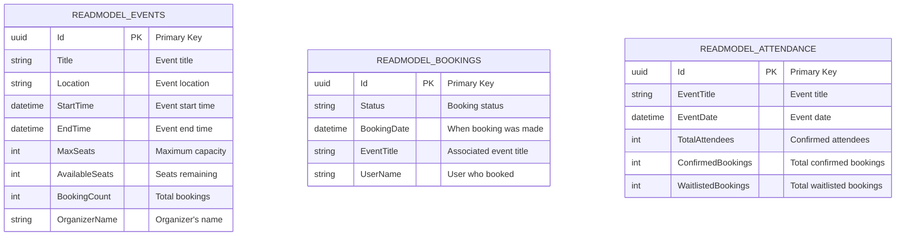

### Database Strategy

| Concern | Technology | Rationale |
|---|---|---|
| **ORM** | EF Core | Migrations and Identity only |
| **Queries** | Dapper | High-performance raw SQL |
| **Concurrency** | RowVersion | Optimistic concurrency control |
| **Transaction** | SQL Transaction | Atomic state + event log commit |
| **Indexes** | To be added | Performance optimization (TODO) |

---

## Testing Strategy

### TDD Workflow

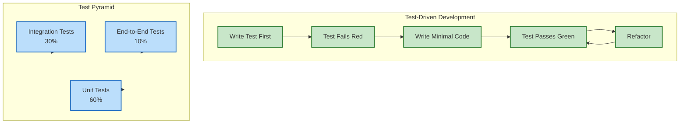

### EMS.UnitTests Structure

```
EMS.UnitTests/
├── Domain/
│   ├── EventAggregateTests.cs       # Overbooking, waitlist assign, ownership
│   ├── BookingAggregateTests.cs     # Cancel rules, status transitions
│   └── UserAggregateTests.cs        # User business rules
├── Application/
│   ├── PlaceBookingHandlerTests.cs  # Happy path, not found, duplicate, concurrency
│   ├── CancelBookingHandlerTests.cs # Success, unauthorized
│   ├── RefreshTokenHandlerTests.cs  # Valid rotation, reuse detection
│   └── CreateEventHandlerTests.cs   # Event creation validation
└── Shared/
    ├── Builders/
    │   ├── EventBuilder.cs           # Test data builder for Event
    │   ├── BookingBuilder.cs         # Test data builder for Booking
    │   └── UserBuilder.cs           # Test data builder for User
    └── Fakes/
        ├── FakeEventRepository.cs    # In-memory repository for testing
        ├── FakeMessagePublisher.cs   # No-op publisher for testing
        └── FakeUnitOfWork.cs        # Unit of work fake
```

### EMS.IntegrationTests Structure

```
EMS.IntegrationTests/
├── Persistence/
│   ├── BookingConcurrencyTests.cs   # 10 parallel requests, 1 seat → exactly 1 success
│   ├── WaitlistPromoteTests.cs      # Cancel → next user promoted atomically
│   └── RepositoryTests.cs           # Repository CRUD operations
├── Messaging/
│   ├── RabbitMqPublishConsumeTests.cs # Event published → consumer updates read model
│   └── DomainEventIntegrationTests.cs # Event flow end-to-end
├── Jobs/
│   └── ReportJobLifecycleTests.cs   # Queued → InProgress → Completed → file exists
└── E2E/
    ├── BookingFlowTests.cs          # Register → Create event → Book → Cancel → Verify
    └── AuthFlowTests.cs             # Login → Refresh → Reuse detection → Revoke
```

### Test Coverage Goals

| Layer | Target Coverage | Tools |
|---|---|---|
| **Domain** | 95%+ | TUnit |
| **Application** | 90%+ | TUnit + Fakes |
| **Infrastructure** | 80%+ | TUnit + Testcontainers |
| **API** | 70%+ | Testcontainers |

### Testing Best Practices

1. **Always TDD**: Write test first, then implementation
2. **Arrange-Act-Assert**: Clear test structure
3. **Test Naming**: `MethodName_StateUnderTest_ExpectedBehavior`
4. **Test Independence**: No shared state between tests
5. **Builders**: Use test data builders for complex objects
6. **Fakes**: Use fakes, not mocks (except when necessary)
7. **Testcontainers**: Use real databases for integration tests

---

## Domain Event Flow

### Event Publishing Flow

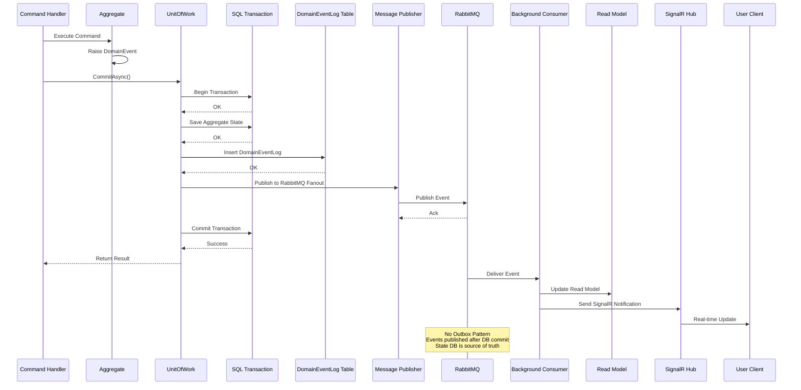

### Domain Event Types (Examples)

| Event | Trigger | Consumer Actions |
|---|---|---|
| `BookingCreatedEvent` | Booking confirmed | Update read model, send SignalR notification |
| `BookingCancelledEvent` | Booking cancelled | Update read model, promote waitlisted user |
| `WaitlistPromotionEvent` | User promoted from waitlist | Send SignalR notification |
| `EventCreatedEvent` | Event created | Update read model |
| `EventUpdatedEvent` | Event updated | Update read model |
| `EventDeletedEvent` | Event soft-deleted | Update read model |
| `ReportJobCompletedEvent` | Report generation finished | Send SignalR notification with download URL |

### Event Publishing Rules

1. **Events published AFTER successful DB commit**
2. **Events published to RabbitMQ fanout exchange**
3. **Multiple consumers can subscribe to same event**
4. **CorrelationId flows from request to event**
5. **EventId is unique per event instance**
6. **No Outbox Pattern - direct publish after commit**

---

## Security & Authentication

### JWT + Refresh Token Flow

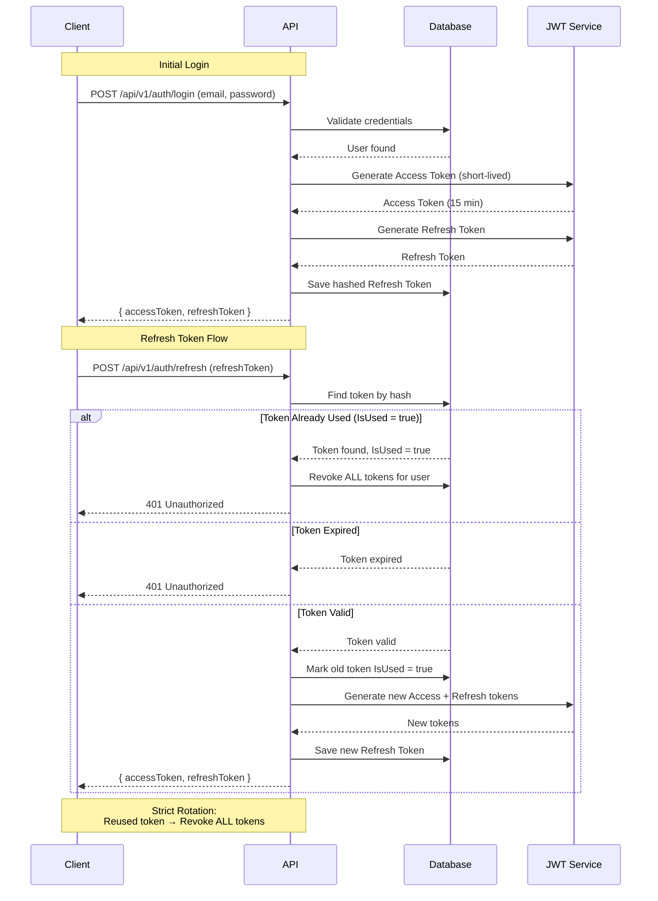

### Authentication Mechanisms

| Mechanism | Purpose | Implementation |
|---|---|---|
| **Password Hashing** | Secure password storage | BCrypt.Net-Next |
| **Access Token** | Short-lived API authentication | JWT (15 minutes) |
| **Refresh Token** | Long-lived session management | Strict rotation, reuse detection |
| **Role-Based Access** | Authorization by role | Admin, Organizer, Member |

### Authorization Rules

| Role | Permissions |
|---|---|
| **Admin** | All endpoints, user management, all reports |
| **Organizer** | Create/Update/Delete own events, view event bookings |
| **Member** | View events, book events, cancel own bookings, view own bookings |

### Rate Limiting

| Endpoint | Type | Strategy |
|---|---|---|
| `/api/v1/events/{id}/bookings` | Booking | IP-based + UserId-based |
| Other endpoints | None | No rate limiting |

### Security Headers (To Be Implemented)

```
TODO: Add security headers:
- X-Content-Type-Options: nosniff
- X-Frame-Options: DENY
- X-XSS-Protection: 1; mode=block
- Strict-Transport-Security: max-age=31536000; includeSubDomains
- Content-Security-Policy: default-src 'self'
```

---

## Performance Considerations

### Caching Strategy

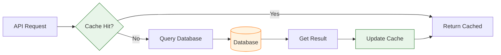

**Hybrid Cache** (Microsoft.Extensions.Caching.Hybrid):
- **Memory Cache**: Fast in-memory caching (per instance)
- **Distributed Cache**: Redis or similar (shared across instances)
- **Cache Duration**: Configurable per resource
- **Cache Invalidation**: On domain events

### Performance Optimization Opportunities

| Area | Current Status | TODO |
|---|---|---|
| **Database Indexes** | Not implemented | Add indexes on frequently queried columns |
| **Query Optimization** | Dapper used | Review and optimize slow queries |
| **Caching** | Hybrid cache available | Implement caching strategy |
| **Async Processing** | SignalR for notifications | Consider background workers for heavy tasks |
| **Connection Pooling** | Default EF Core | Tune connection pool size |
| **Response Compression** | Not implemented | Add compression middleware |

### Concurrency Control

**Optimistic Concurrency**:
- `RowVersion` column on `Events` and `Bookings` tables
- Booking save: `UPDATE Events SET BookedSeats = @new WHERE Id = @id AND RowVersion = @expected`
- 0 rows affected → throw `ConcurrencyException` → return `409 Conflict`
- Client is responsible for retry

---

## Design Decisions

<!-- TODO: Manual Update Required -->

This section documents the rationale behind key architectural and technical decisions made during the design and development of EMS.

### Why Clean Architecture?

**Decision**: Adopt Clean Architecture with 5 layers
**Rationale**:
- Separates business logic from infrastructure concerns
- Makes testing easier (dependencies inverted)
- Allows technology changes without business impact
- Aligns with SOLID principles

**Trade-offs**:
- Increased complexity initially
- More boilerplate code
- Steeper learning curve for new developers

**Alternatives Considered**:
- Traditional N-Tier Architecture
- Hexagonal Architecture
- Onion Architecture

### Why CQRS?

**Decision**: Separate commands and queries with MediatR
**Rationale**:
- Optimizes read and write operations independently
- Enables complex business logic in commands
- Improves performance with read models
- Scales well for complex domains

**Trade-offs**:
- Increased code duplication (command/query handlers)
- More complex data synchronization
- Steeper learning curve

**Alternatives Considered**:
- Traditional CRUD operations
- Command Query Responsibility Segregation without MediatR

### Why Modular Monolith?

**Decision**: Single deployable unit with clear module boundaries
**Rationale**:
- Easier deployment and monitoring
- Lower operational overhead
- Clear separation of concerns
- Can be split into microservices later if needed

**Trade-offs**:
- Single point of failure
- Limited independent scaling
- Shared database

**Alternatives Considered**:
- Microservices from the start
- Distributed Monolith

### Why Dapper + EF Core?

**Decision**: Use EF Core for migrations, Dapper for queries
**Rationale**:
- EF Core: Easy migrations, change tracking
- Dapper: High-performance raw SQL queries
- Best of both worlds
- Industry-proven combination

**Trade-offs**:
- Two ORMs to learn and maintain
- Potential inconsistency in data access patterns

**Alternatives Considered**:
- EF Core only
- Dapper only
- Other ORMs (NHibernate, Dapper.Contrib)

### Why RabbitMQ?

**Decision**: RabbitMQ for domain event messaging
**Rationale**:
- Reliable message delivery
- Fanout exchange for multiple consumers
- Industry-standard solution
- Good .NET client library

**Trade-offs**:
- Additional infrastructure dependency
- Operational complexity
- Message ordering challenges

**Alternatives Considered**:
- Azure Service Bus
- Kafka
- In-memory event bus (not production-ready)

<!-- TODO: Add more design decisions as they are made -->

---

## Deployment Strategy

<!-- TODO: Manual Update Required -->

This section documents how EMS is deployed to different environments.

### Environments

| Environment | Purpose | URL | Database |
|---|---|---|---|
| **Development** | Local development | localhost | LocalDB |
| **Staging** | Pre-production testing | staging.ems.com | SQL Server (staging) |
| **Production** | Live production | api.ems.com | SQL Server (production) |

### Deployment Process

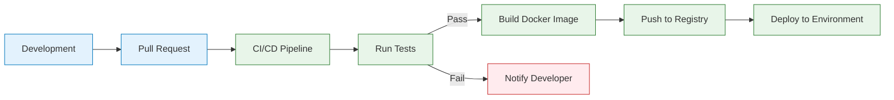

### Infrastructure Requirements

**Development**:
- .NET 10.0 SDK
- SQL Server LocalDB
- RabbitMQ (Docker or local)
- SignalR compatible web server

**Staging/Production**:
- Docker container
- SQL Server (managed or self-hosted)
- RabbitMQ (managed or self-hosted)
- Reverse proxy (Nginx, etc.)
- SSL certificate
- Monitoring and logging

### Docker Deployment (Example)

```yaml
# TODO: Create actual Dockerfile
FROM mcr.microsoft.com/dotnet/aspnet:10.0
WORKDIR /app
COPY . .
ENTRYPOINT ["dotnet", "EMS.API.dll"]
```

### Configuration Management

- **Development**: appsettings.Development.json
- **Staging**: appsettings.Staging.json
- **Production**: Environment variables + Key Vault

### CI/CD Pipeline (TODO)

<!-- TODO: Define CI/CD pipeline -->
1. Pull Request created
2. Automated tests run (unit + integration)
3. Code quality checks (linting, security scan)
4. Build Docker image
5. Push to container registry
6. Deploy to staging
7. Run smoke tests
8. Promote to production (manual approval)

---

## Future Enhancements

<!-- TODO: Manual Update Required -->

This section documents planned features, improvements, and technical debt.

### Short-Term (Next 1-3 months)

- [ ] **Complete Business Domain Implementation**
  - [ ] Implement Event aggregate
  - [ ] Implement Booking aggregate
  - [ ] Implement User aggregate
  - [ ] Implement all business rules

- [ ] **API Endpoints**
  - [ ] Implement all controllers
  - [ ] Add request/response DTOs
  - [ ] Add API versioning middleware
  - [ ] Add OpenAPI/Swagger documentation

- [ ] **Testing**
  - [ ] Increase test coverage to targets
  - [ ] Add integration tests for all endpoints
  - [ ] Add performance tests

- [ ] **Infrastructure**
  - [ ] Configure RabbitMQ connection
  - [ ] Implement domain event publisher
  - [ ] Implement background consumers
  - [ ] Configure SignalR hubs

- [ ] **Security**
  - [ ] Implement JWT authentication
  - [ ] Implement refresh token rotation
  - [ ] Add authorization policies
  - [ ] Add security headers
  - [ ] Implement rate limiting

### Medium-Term (3-6 months)

- [ ] **Caching Strategy**
  - [ ] Implement cache for read models
  - [ ] Configure Redis for distributed cache
  - [ ] Cache invalidation on domain events

- [ ] **Performance Optimization**
  - [ ] Add database indexes
  - [ ] Optimize slow queries
  - [ ] Add response compression
  - [ ] Tune connection pooling

- [ ] **Monitoring & Observability**
  - [ ] Configure structured logging (Serilog)
  - [ ] Add application metrics (Prometheus)
  - [ ] Set up distributed tracing (Jaeger/Zipkin)
  - [ ] Configure health checks
  - [ ] Set up alerting rules

- [ ] **Reporting**
  - [ ] Implement report generation
  - [ ] Add CSV export
  - [ ] Implement background job processing
  - [ ] Add SignalR progress notifications

### Long-Term (6-12 months)

- [ ] **Feature Enhancements**
  - [ ] Add waitlist management
  - [ ] Add payment integration
  - [ ] Add email notifications
  - [ ] Add admin dashboard
  - [ ] Add analytics and reporting

- [ ] **Infrastructure Improvements**
  - [ ] Implement file storage abstraction
  - [ ] Add Azure Blob Storage support
  - [ ] Implement idempotency keys
  - [ ] Add database migrations

- [ ] **Operational Improvements**
  - [ ] Set up production monitoring
  - [ ] Implement automated backups
  - [ ] Configure disaster recovery
  - [ ] Implement blue-green deployment

- [ ] **Scaling**
  - [ ] Consider splitting into microservices (if needed)
  - [ ] Implement read replicas
  - [ ] Add CDN for static content

### Technical Debt

- [ ] **Code Quality**
  - [ ] Add code coverage reporting
  - [ ] Set up static analysis (SonarQube)
  - [ ] Refactor complex methods
  - [ ] Improve error handling

- [ ] **Documentation**
  - [ ] Complete API documentation
  - [ ] Add architecture decision records (ADRs)
  - [ ] Document deployment procedures
  - [ ] Create runbooks for common operations

- [ ] **Testing**
  - [ ] Add load testing
  - [ ] Add chaos engineering tests
  - [ ] Improve test data management
  - [ ] Add contract testing

### Potential Refactoring Opportunities

- [ ] Consider introducing a message broker abstraction for RabbitMQ
- [ ] Evaluate if domain events can be simplified
- [ ] Review if additional value objects can be extracted
- [ ] Consider introducing specification pattern for complex queries
- [ ] Evaluate if read models can be further optimized

---

## Appendices

### A. Coding Conventions

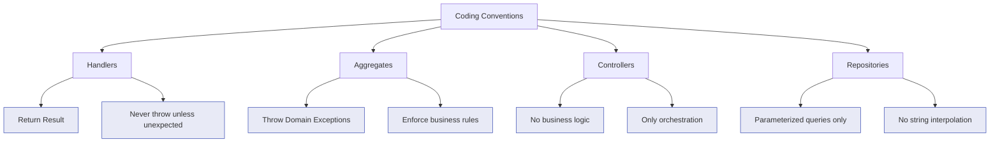

**Summary**:
- **Handlers return `Result<T>`** — never throw except for truly unexpected errors
- **Aggregates throw Domain Exceptions** for business rule violations
- **No business logic in Controllers or Handlers** — only orchestration
- **All Dapper queries use parameterized inputs** — no string interpolation
- **CorrelationId flows** from HTTP header → Command → DomainEvent → Log
- **One Command/Query per file** — folder named after the operation

### B. Mermaid Diagram Reference

This document uses Mermaid syntax for visualizing architecture. Supported diagrams:

| Diagram Type | Syntax | Purpose |
|---|---|---|
| **Flowchart** | `graph` | Solution structure, dependency rules, CQRS pattern |
| **Sequence Diagram** | `sequenceDiagram` | Domain event flow, API calls, authentication |
| **Entity Relationship** | `erDiagram` | Database schema |
| **Class Diagram** | `classDiagram` | Interfaces and implementations |
| **Mindmap** | `mindmap` | Architecture patterns overview |

All diagrams are compatible with GitHub, GitLab, VS Code, and most documentation tools.

### C. Correlation ID Flow

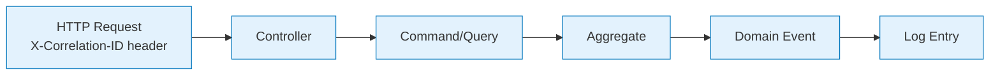

**Implementation**: CorrelationId is extracted from HTTP header and passed through all layers, appearing in:
- Serilog log entries
- DomainEventLog table
- AuditLogs table
- SignalR notifications

### D. File Storage Abstraction

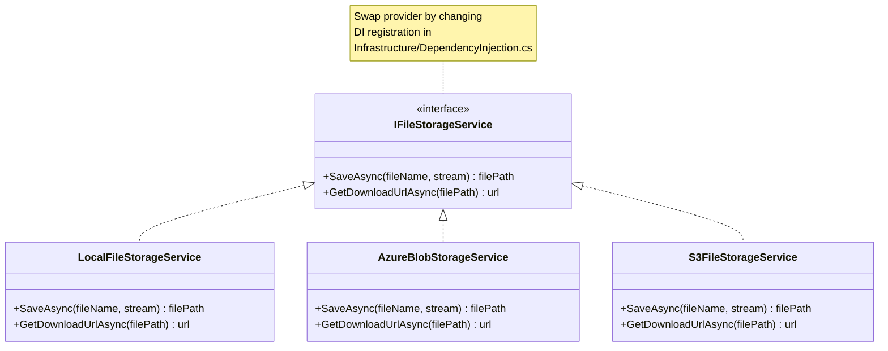

**Default**: LocalFileStorageService (stores in `wwwroot/reports/`)

---

**Document Version**: 1.0.0
**Last Updated**: March 24, 2026
**Maintained By**: Development Team

---

> **Note**: This architecture documentation is auto-generated and should be kept in sync with code changes. Sections marked with `<!-- TODO: Manual Update Required -->` require manual input from the development team.
